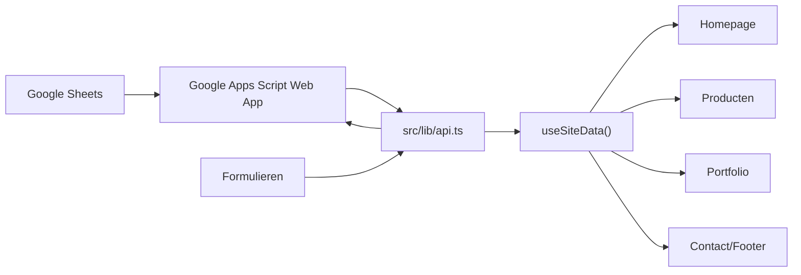

# Van Appiah klantwebsite

Klantgerichte website voor Van Appiah. De site is bedoeld voor potentiele klanten en bevat geen adminpaneel. Content zoals bedrijfsgegevens, producten en portfolio-items wordt dynamisch geladen uit Google Sheets via een Google Apps Script Web App.

## Inhoud

- React 19 + TanStack Router/Start
- Vite build/devserver
- Tailwind CSS v4 styling
- React Query voor gedeelde site-data
- Google Apps Script Web App als databron en formulier-endpoint
- Dynamische pagina's voor home, producten, portfolio, offerte en contact

## Belangrijkste bestanden

| Bestand | Doel |
| --- | --- |
| `src/lib/api.ts` | Centrale koppeling met Google Apps Script, data-normalisatie en formulier-posts |
| `src/hooks/use-site-data.ts` | React Query hook voor gedeelde site-data |
| `src/routes/index.tsx` | Homepage met dynamische bedrijfsgegevens, producten en portfolio |
| `src/routes/producten.index.tsx` | Productenoverzicht |
| `src/routes/producten.$slug.tsx` | Productdetailpagina |
| `src/routes/portfolio.index.tsx` | Portfolio-overzicht |
| `src/routes/portfolio.$slug.tsx` | Portfolio-detailpagina |
| `src/routes/contact.tsx` | Contactgegevens en contactformulier |
| `src/routes/offerte.tsx` | Offerteformulier |
| `src/components/site/Header.tsx` | Navigatie en VA-merk |
| `src/components/site/Footer.tsx` | Footer, contactgegevens en nieuwsbrief |
| `src/components/site/ProductRequestDialog.tsx` | Productaanvraag modal |
| `src/styles.css` | Globale styling en Tailwind tokens |
| `vite.config.ts` | Vite/TanStack Start configuratie |

## Google Apps Script koppeling

De Web App URL staat in `src/lib/api.ts`:

```ts
export const WEB_APP_URL =
  "https://script.google.com/macros/s/AKfycbxjN8mHsT_OJnGHuxzErclU25OGyfxG7DnbSxUYbfGphSrHUY2zKIh7gfBRnmiis8Xl/exec";
```

De site ondersteunt nu lichte acties voor snelle eerste rendering:

```txt
GET ?action=getFastSiteData
GET ?action=getInitialSiteData
GET ?action=getProductsPage&offset=0&limit=6
GET ?action=getPortfolioPage&offset=0&limit=6
GET ?action=getQuoteOptions
GET ?action=getProductDetail&id=...
GET ?action=getPortfolioDetail&id=...
GET ?action=getProductImages&id=PRD-...
GET ?action=getPortfolioImages&id=POR-...
```

`getSiteData` blijft als fallback bestaan voor oude deployments, maar de eerste website-load gebruikt standaard `getFastSiteData`. Deze route stuurt product- en portfoliotekst direct terug zonder Drive-afbeeldingen. Zie [docs/google-apps-script-endpoints.md](docs/google-apps-script-endpoints.md) voor de Apps Script implementatie.

Verwachte response voor `getFastSiteData`:

```json
{
  "ok": true,
  "bedrijfsgegevens": {},
  "producten": [],
  "portfolio": []
}
```

De frontend probeert eerst een normale `fetch`. Als dat door CORS of een trage Apps Script cold start niet goed werkt, gebruikt de site JSONP als fallback. Producten, portfolio en offerte hebben aparte React Query caches zodat navigeren niet opnieuw de volledige sheetdata hoeft te laden.

Belangrijk voor snelheid: `fetch` en JSONP worden parallel gestart. De eerste succesvolle response wint, zodat de browser niet eerst meerdere seconden hoeft te wachten tot CORS/fetch faalt.

## Datamodel

### Bedrijfsgegevens

De site toont bedrijfsgegevens alleen als `actief` aan staat of leeg is. Als `actief` expliciet uit staat, worden de bedrijfsgegevens verborgen.

Ondersteunde velden:

```txt
bedrijfsnaam
slogan
beschrijving
adres
telefoonnummer
email_1
email_2
email_3
openingstijd_1
openingstijd_2
openingstijd_3
instagram
tiktok
linkedin
website
actief
```

Lege velden worden automatisch niet getoond. `telefoonnummer` mag uit Sheets als getal of tekst komen; de frontend normaliseert dit naar tekst.

### Producten

Ondersteunde velden:

```txt
id
titel
slug
beschrijving
categorie
prijs_vanaf
onderhoud_eenmalig
onderhoud_per_maand
onderhoud_uitleg
images
```

Producten worden gebruikt op:

- homepage
- `/producten`, gefaseerd met `offset` en `limit`
- `/producten/$slug`, via een beperkte productpagina-query
- offerteformulier als keuze-optie
- productaanvraag modal

Als `images` leeg is, toont de site `Geen afbeelding`.

### Portfolio

Ondersteunde velden:

```txt
id
titel
slug
beschrijving
klantnaam
categorie
images
```

Portfolio-items worden gebruikt op:

- homepage
- `/portfolio`, gefaseerd met `offset` en `limit`
- `/portfolio/$slug`, via een beperkte portfoliopagina-query

Als `images` leeg is, toont de site `Geen afbeelding`.

### Afbeeldingen

Afbeeldingen blokkeren de eerste render niet. `getFastSiteData`, `getProductsPage` en `getPortfolioPage` mogen items zonder images teruggeven, zolang `driveFolderId` of `id` aanwezig is. De frontend haalt afbeeldingen daarna lazy op via `getProductImages` en `getPortfolioImages`.

De site ondersteunt afbeeldingen als string-URL of als object uit Google Drive, bijvoorbeeld:

```json
{
  "id": "drive-file-id",
  "name": "image.jpg",
  "url": "https://drive.google.com/uc?export=view&id=...",
  "thumbnail": "https://drive.google.com/thumbnail?id=...&sz=w900",
  "viewUrl": "https://drive.google.com/file/d/.../view"
}
```

De frontend gebruikt bij voorkeur `thumbnail` en valt terug op `url`.

## Formulieren

Alle formulieren posten naar dezelfde Apps Script URL met `POST` en `text/plain` om CORS-preflight te vermijden.

Ondersteunde acties:

| Actie | Gebruikt door |
| --- | --- |
| `submitMessage` | Contactformulier |
| `submitQuote` | Offerteformulier |
| `submitSubscriber` | Nieuwsbrief in footer |
| `submitProductRequest` | Productaanvraag modal |

Voorbeeld payload:

```json
{
  "action": "submitMessage",
  "data": {
    "voornaam": "Voornaam",
    "email": "naam@example.com",
    "bericht": "Vraag of bericht"
  }
}
```

Bij succes toont de site een succesmelding. Bij een echte netwerkfout blijft de klant in het formulier en verschijnt er een foutmelding.

## Routes

| Route | Omschrijving |
| --- | --- |
| `/` | Homepage met dynamische bedrijfsgegevens, producten en portfolio |
| `/diensten` | Dienstenpagina |
| `/producten` | Productenoverzicht uit Sheets |
| `/producten/$slug` | Productdetail uit Sheets |
| `/portfolio` | Portfolio-overzicht uit Sheets |
| `/portfolio/$slug` | Portfolio-detail uit Sheets |
| `/offerte` | Offerte-aanvraag |
| `/over` | Over Van Appiah |
| `/contact` | Contactgegevens en contactformulier |

## Installatie

Installeer dependencies:

```bash
npm install
```

Start de devserver:

```bash
npm run dev
```

Lokale URL:

```txt
http://127.0.0.1:8080/
```

De exacte poort kan door de Vite/Lovable configuratie worden gekozen.

## Scripts

| Command | Doel |
| --- | --- |
| `npm run dev` | Start lokale devserver |
| `npm run build` | Maakt productiebuild |
| `npm run build:dev` | Maakt development build |
| `npm run preview` | Preview van build |
| `npm run lint` | ESLint |
| `npm run format` | Prettier formatting |

## Build en output

Productiebuild:

```bash
npm run build
```

Output:

```txt
dist/client
dist/server
```

De server-build gebruikt TanStack Start met de server entry uit `src/server.ts`.

## Styling

De site gebruikt Tailwind CSS v4 met globale tokens in `src/styles.css`.

Belangrijke ontwerpkeuzes:

- luxe zakelijke uitstraling
- donker/wit/grijs met subtiele accenten
- VA als merkbadge
- responsive layouts voor mobiel, tablet en desktop
- kaarten voor producten en portfolio
- lege afbeeldingsstate: `Geen afbeelding`

## Dataflow



## Performance

De site laadt bewust niet meer alle data tegelijk.

- Homepage gebruikt `getFastSiteData` via `getInitialSiteData()` in de frontend en toont alleen de eerste producten en portfolio-items.
- Producten gebruikt `getProductsPage` met `offset` en `limit`, standaard 6 tegelijk.
- Portfolio gebruikt `getPortfolioPage` met `offset` en `limit`, standaard 6 tegelijk.
- Offerte gebruikt `getQuoteOptions` en laadt geen volledige producten of portfolio.
- React Query gebruikt aparte keys: `site-initial`, `products`, `portfolio`, `quote-options`, `product-images`, `portfolio-images`.
- Product/detail queries gebruiken `product-detail` en `portfolio-detail`, met kaartdata als `initialData`.
- Cache staat minimaal 5 minuten stale en 15 minuten in memory.
- Afbeeldingen gebruiken `imageSource()`, thumbnails, `decoding="async"` en lazy loading buiten de eerste zichtbare items.
- `Meer laden` gebruikt infinite queries, waardoor bestaande kaarten zichtbaar blijven terwijl de volgende pagina binnenkomt.
- Product- en portfoliodetailpagina's tonen kaartdata direct uit de bestaande React Query cache of localStorage-cache, zodat klikken vanuit een kaart direct voelt.
- Home, producten en portfolio slaan publieke data op in localStorage als snelle placeholder voor een volgende page load.

## Backend performance

De Apps Script backend in `Backend/Code.gs` heeft een aparte snelle publieke route:

```txt
?action=getFastSiteData
```

Deze route:

- draait geen `setupVanAppiahSite()`
- leest alleen `Bedrijfsgegevens`, `Portfolio` en `Producten`
- sorteert op `volgorde`
- filtert met `zichtbaar`
- haalt geen Drive-afbeeldingen op
- cachet de publieke response met `CacheService`
- ondersteunt `fresh=1` om cache te omzeilen

Lazy image routes:

```txt
?action=getProductDetail&id=...
?action=getPortfolioDetail&id=...
?action=getProductImages&id=...
?action=getPortfolioImages&id=...
```

Admin-wijzigingen aan bedrijfsgegevens, producten of portfolio verhogen de publieke cacheversie, waardoor nieuwe publieke data opnieuw wordt opgebouwd.

## Foutafhandeling

De site moet niet crashen als:

- Apps Script tijdelijk traag is
- CORS directe fetch blokkeert
- Apps Script geen JSON teruggeeft
- `telefoonnummer` als getal uit Sheets komt
- `images` leeg is
- `images` objecten zijn in plaats van strings
- bedrijfsgegevens inactief zijn

De centrale normalisatie in `src/lib/api.ts` vangt deze gevallen op.

## Debuggen

Controleer eerst de webapp-response direct:

```txt
https://script.google.com/macros/s/AKfycbxjN8mHsT_OJnGHuxzErclU25OGyfxG7DnbSxUYbfGphSrHUY2zKIh7gfBRnmiis8Xl/exec?action=getSiteData
```

Let op:

- response moet met `{ "ok": true }` beginnen
- `producten` moet een array zijn
- `portfolio` moet een array zijn
- `bedrijfsgegevens` moet een object zijn
- Apps Script-deployment moet toegankelijk zijn voor de websitebezoeker

Als de site lang blijft laden, is Apps Script vaak koud aan het starten. De JSONP-fallback wacht daarom langer dan een normale API.

Snelle endpoint testen:

```txt
https://script.google.com/macros/s/.../exec?action=getFastSiteData
https://script.google.com/macros/s/.../exec?action=getFastSiteData&fresh=1
https://script.google.com/macros/s/.../exec?action=getProductsPage&offset=0&limit=6
https://script.google.com/macros/s/.../exec?action=getPortfolioPage&offset=0&limit=6
```

## Belangrijke regels

- Geen adminpaneel op deze klantwebsite plaatsen.
- Nieuwe content hoort in Google Sheets, niet hardcoded in de frontend.
- Nieuwe data uit Apps Script altijd normaliseren in `src/lib/api.ts`.
- Lege velden niet zichtbaar maken in de UI.
- Afbeeldingen altijd via `imageSource()` tonen.
- Product- en portfolio-links gebruiken `slug`, daarna `id`, daarna `titel` als fallback.
